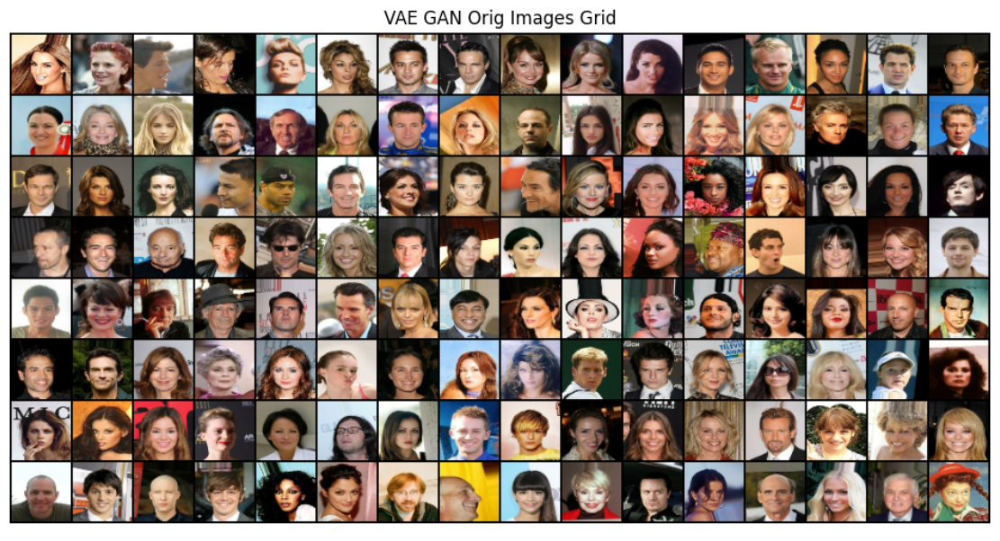
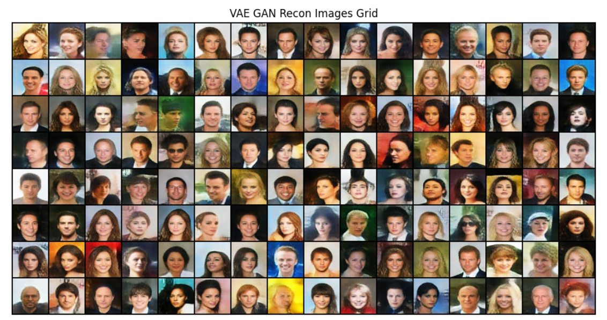
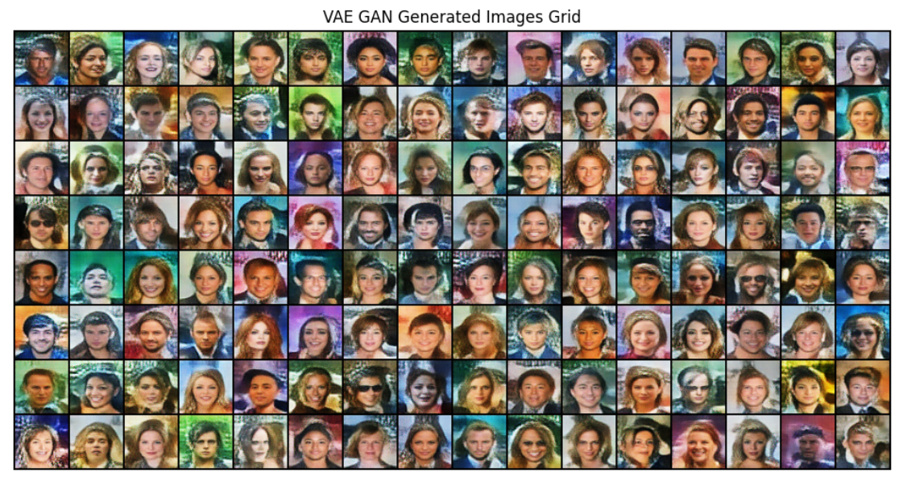

# VAE-GAN-Hybrid
# VAE-GAN Hybrid & U-Net Discriminator

This repository implements a hybrid VAE-GAN model with a U-Net discriminator for image processing tasks. The model uses TensorFlow and Keras to train a generative model for image generation and reconstruction. The code also leverages pre-trained models like VGG19 for feature extraction.

## Table of Contents

- [Introduction](#introduction)
- [Requirements](#requirements)
- [Usage](#usage)
- [Results](#results)
- [Training Details](#training)

## Introduction

This project demonstrates the use of a hybrid Variational Autoencoder (VAE) and Generative Adversarial Network (GAN) with a U-Net discriminator. The goal is to generate high-quality images and reconstruct them, leveraging the strengths of both VAEs and GANs. The model also utilizes feature extraction from VGG19 for better image processing.

## Requirements

The following libraries are required to run the code:

- `matplotlib` – for plotting results
- `numpy` – for numerical operations
- `tensorflow` – for model building and training
- `keras` – for neural network models
- `torch` – for PyTorch functionalities
- `torchvision` – for computer vision utilities
- `warnings` – to handle warnings
- `random` – for random seed setting

## Training Details
- the training took about [4-5] hours and the results is feasible compared to other github repos and the difficulty of the Challenge.  

## Usage
    - **Pre-trained Weights**: loading model pretrained weights using keras load model.
    - **Dataset**: Dataset is celebA (64,64,3).
    - **Test Notebook**: Add the path for weights and run the test notebook for results.
## Results 

### Original Image:

### Reconstructed Image:

### Noise Prior:

